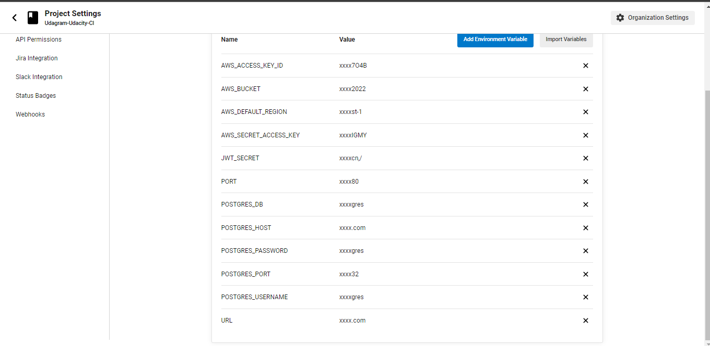
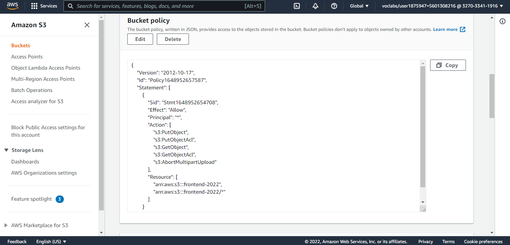
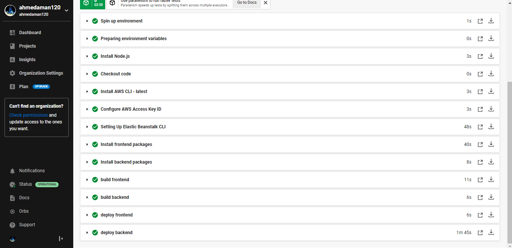
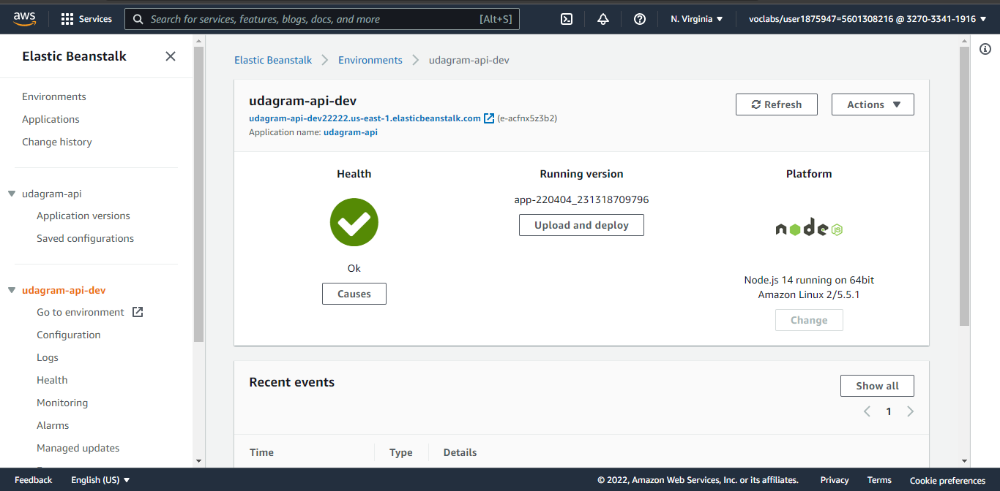
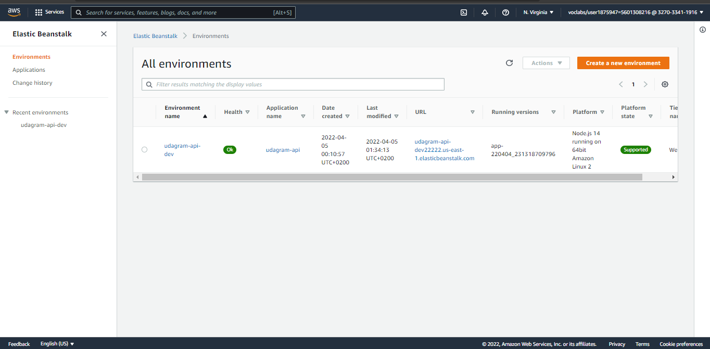
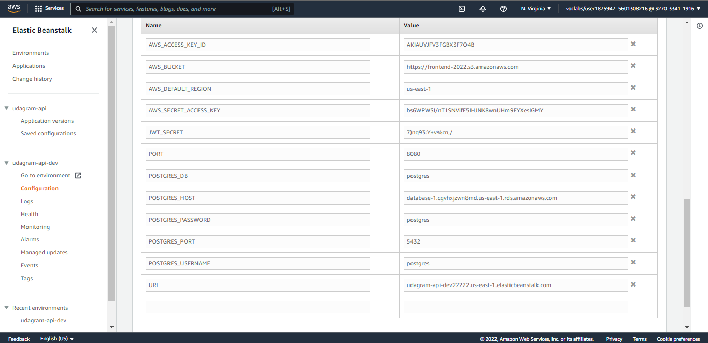
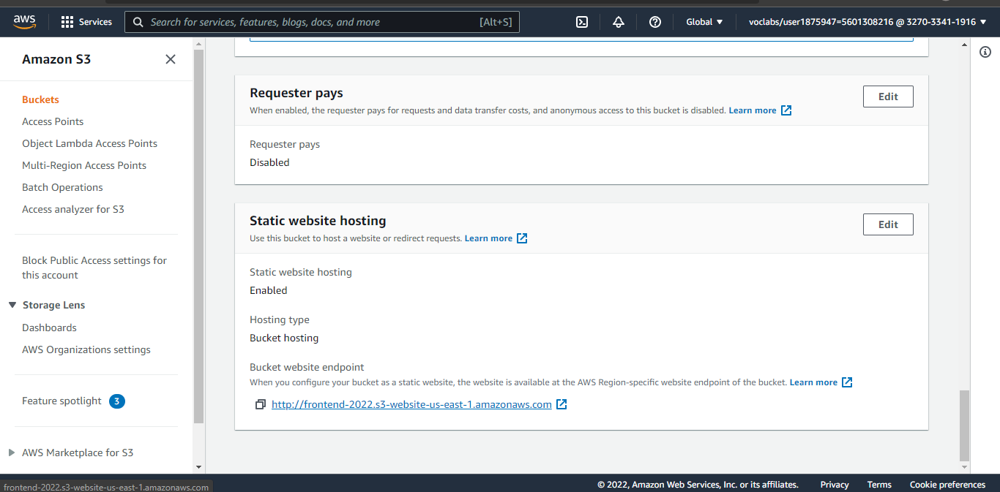

## `Udagram` Deploy 🚀 Full Stack App- EG_FWD Program

This project contains two main folder first one ` udagram-frontend ` this for front end 🎨 another one `udagram-api` this for api 🚢 


##  `Udagram` Plan

### Requirments
1. Nodejs up to 14
2. Angular
3. AWS CLI
4. Elastic beanstalk CLI
### Environment Components
1. Backend and Frontend folders
2. Github repo
3. Pipline on circleCI 
4. S3 bucket to host frontend after had been build on CI pipline
5. Elastic beanstalk deployed the app by CI to build api enviroment and create the database tables
6. RDS postgress server to contain the database
.png)

### Prepare the project to get in CI pipline
on this phase we prpare our project to build localy by using packge.json script
```

yarn build # this for build the project
yarn deploy # this for run bash scripts that will be responsible for deploying our project
```
### Prepare enviroment variables on CircleCi
in this phase we assume our secrets variables on circleci. this list of our enviroment variable that we use in this project. 
```
    AWS_ACCESS_KEY_ID=$AWS_ACCESS_KEY_ID 
    AWS_SECRET_ACCESS_KEY=$AWS_SECRET_ACCESS_KEY
    AWS_BUCKET=$AWS_BUCKET
    AWS_DEFAULT_REGION=$AWS_DEFAULT_REGION
    JWT_SECRET=$JWT_SECRET
    PORT=$PORT
    POSTGRES_DB=$POSTGRES_DB
    POSTGRES_HOST=$POSTGRES_HOST
    POSTGRES_PASSWORD=$POSTGRES_PASSWORD
    POSTGRES_PORT=$POSTGRES_PORT
    POSTGRES_USERNAME=$POSTGRES_USERNAME
    URL=$URL
```


### Create elastic beanstalkd enviroment 
in this phase I created enviroment with eb cli from local to use it with ci
```
eb create udagram-api-dev
```
### Create S3 bucket
when creating s3 we must make sure couple of things
1. the bucke static web hosting is enabled
2. the bucket policy is defined well


### Create CircleCI 🚑 configrations 
in this part of our project we prepare CicleCi servers to build our project and install our requirments we use docker image called `cimg/base:stable` to be the base enviroment to run our commends and install on it `circleci/node@5.0.0`, `circleci/aws-cli@2.1.0` and `circleci/aws-elastic-beanstalk@1.0.0` to use it on running our bash files.

after define the requirements to our project we must define the flow to build and deploy our api or build and deploy and upload our frontend.

### Connect all this togather 🧑‍✈️ on the fly.
1. push the project to watched repo by circleci contains .circleci folder
2. wait acouple of minutes and take a cup of ☕
3. after finish jobs on CircleCI you must show this

4. take a look on your elasticbeanstalk you will find this



5. test your projcet by go to your s3 and go to s3 bucket properties and scroll to `Static Website hosting` 

6. check your Postgres performance using monitoring on aws console
.png) 

